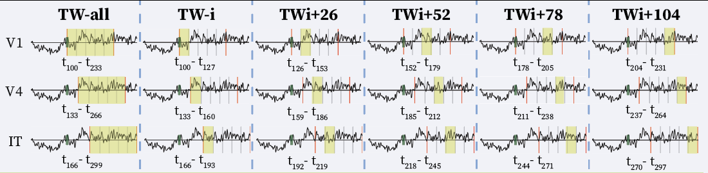

# MonkeySee
MonkeySee: Reconstructing natural images from multiunit activity

## Introduction

In this repository you will find the source code for the Spatial-based and Temporal-based experiments in the "MonkeySee: Reconstructing natural images from multiunit activity" paper. Both folders contain the data preprocessing codes (`data_prep_spatial.py` and `data_prep_spatial.py`) and the training codes (`train_spatial` and `train_temporal`). 

## Spatial-based Training 
For the spatial-based model, we splitted the channels into 10 electrodes. The locations of these excitations are shown in the RFstatic locations figure.

## Temporal-based Training 

Here we split the data into 5 time chunks.
 

The reconstructions of the entire test dataset are shown in the following figure:
 