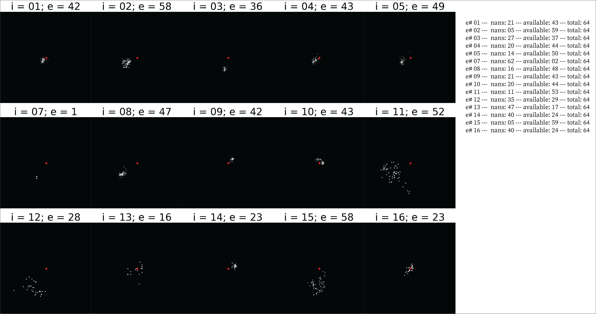

# MonkeySee: Reconstructing natural images from multiunit activity

## Introduction

In this repository you will find the source code for the Spatial-based and Temporal-based experiments in the "MonkeySee: Reconstructing natural images from multiunit activity" paper. Both folders contain the data preprocessing codes ([`data_prep_spatial.py`](SpatialBased/data_prep_spatial.py) and [`data_prep_spatial.py`](TemporalBased/data_prep_temporal.py)) and the training codes ([`train_spatial.py`](SpatialBased/train_spatial.py) and [`train_temporal.py`](TemporalBased/train_temporal.py)). 

## Spatial-based Training 

### RFSimages 
For the spatial-based training (SB-training), the model has 15 input channels where each input channel receives RFSimages from an electrode array. The locations of these excitations are presented in the RFstatic locations figure.

### Reconstructions (SB)
The model is trained with 15 input channels where each channel receives data from one electrode.
 

## Temporal-based Training 
### Time-windows 
We also train a model that is split into 3 ROIs and time chunks of 5, instead of 15 electrodes (TB-training). This means we take a timewindow of the original time windows that we train the spatial-based model on, and split them onto 5. Then we take the average of those windows and take the dot product between the signals the the static RFSimage belonging to the region of interest. 

The time windows are 133ms originally. We train them on 27 ms for this experiment giving each channel 27ms. The exact time windows are displayed below.

 

### Reconstructions (SB)
The model is trained with 15 input channels, with each channel receiving 5 RFSimages per ROI. The reconstructions (R) with their corresponding targets (T) of the entire test dataset are shown in the following figure:

 